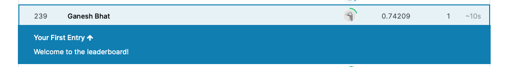

# Capstone Project: Create a Customer Segmentation Report for Arvato Financial Services
## Overview
In this project, we will analyze demographics data for customers of a mail-order sales company in Germany, comparing it against demographics information for the general population. 
We have been given the data-set as outlined below and we will use a combination of unsupervised and supervised learning techniques to answer few questions for the customer as outlined in the problem statement.

## Problem statement
1. Identify the set of people mail-order sales company in Germany must target with their marketing campaign, instead of targeting all the people across germany.
1. Also identify customer segmentation, identify part of the population that best describes the core customer base ( ex: regions, gender and income group etc ) of people the company shall focus on, for their marketing campaign.
1. Company needs to know the prediction on which of those individuals are most likely to convert into becoming customers for the company so that they can target such individuals better using instruments like coupons, ads etc.

## Prerequisites
* Make sure to have AWS Subscription and run inside AWS Sagemaker only
* Notebook must be of type ml.t3.2xlarge and have 5GB plus storage space

## Installation
Intallations are part of the notebook itself
We are working with sagemaker 1.x here
Ensure the kernal used is conda_pytorch_p36

Notebooks must be run in following order, as they are related. ( they will create artefacts in )
* 1. Feature Engineering.ipynb
* 2. UnsupervisedLearning.ipynb.json
* 3. Supervised Learning .ipynb.json

## Input Files
Arvato provided a couple of files for this project but as part of the terms and conditions I'm not allowed to share/include them in this repository.

Below describes the inputs and characteristic of the dataset.
* Udacity_AZDIAS_052018.csv: Demographics data for the general population of Germany; 891 211 persons (rows) x 366 features (columns).
* Udacity_CUSTOMERS_052018.csv: Demographics data for customers of a mail-order company; 191 652 persons (rows) x 369 features (columns).
* Udacity_MAILOUT_052018_TRAIN.csv: Demographics data for individuals who were targets of a marketing campaign; 42 982 persons (rows) x 367 (columns).
* Udacity_MAILOUT_052018_TEST.csv: Demographics data for individuals who were targets of a marketing campaign; 42 833 persons (rows) x 366 (columns).

## software and libraries 
This must be run in AWS Sagemaker notebook only

## Thanks
Thanks for providing the dataset to Arvato, without which this project wouldn't have been possible

## Kaggle 

